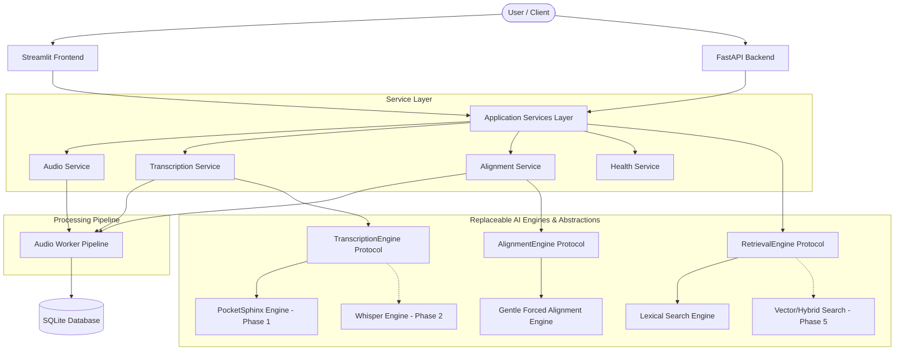

# Intell Audio Inference & Retrieval System

An intelligent, temporal audio processing and retrieval platform designed to ingest audio files or YouTube streams, perform automated speech recognition (ASR), generate word-level timestamp alignments, and provide exact lexical and temporal audio search with timestamp-based seeking and playback.

---

## Modernization Journey & Architecture

This project was originally built as a mini-project in 2022. It has undergone a comprehensive **Phase 1 Architectural Modernization**, evolving from a monolithic script into a clean, modular, 2026-grade application platform without breaking V1 baseline capabilities.

### System Architecture Diagram



---

## Currently Implemented (Phase 1 Baseline)

- **Audio Acquisition:** File upload (`.mp3`, `.wav`, `.m4a`, `.flac`) and YouTube audio extraction.
- **Speech Recognition (ASR):** PocketSphinx offline speech-to-text transcription isolated behind the `TranscriptionEngine` interface.
- **Forced Alignment:** Integration with local Gentle forced-alignment Docker server for word-level timestamp generation.
- **Temporal Retrieval:** Non-destructive single-word and multi-word phrase lexical search.
- **Interactive Audio Navigation:** Timestamp-based audio seeking and segment playback in Streamlit UI.
- **Database Persistence:** SQLite database storing structured `AudioAsset`, `ProcessingJob`, `Transcript`, and `TranscriptWord` records.
- **FastAPI Foundation:** OpenAPI-compliant backend API featuring `/health`, upload ingestion, transcript retrieval, and search endpoints.
- **Environment Management:** Configuration via `pydantic-settings`, `.env.example`, and strict `pathlib.Path` data directory isolation (`data/`).

---

## Planned Future Phases (Roadmap)

- **PHASE 2 — Modern ASR:** Replace PocketSphinx with Whisper / `faster-whisper` for high-accuracy speech recognition.
- **PHASE 3 — Temporal Transcript:** Rich transcript representations with confidence scores, paragraph segmentation, and speaker turn markers.
- **PHASE 4 — Intelligence:** Speaker diarization, topic modeling, named entity recognition (NER), and automatic chapter generation.
- **PHASE 5 — Semantic Retrieval:** Vector embeddings, FAISS / Qdrant vector database integration, and hybrid lexical-semantic search.
- **PHASE 6 — Modern Web UI:** Production-grade interactive React / Next.js audio waveform frontend.
- **PHASE 7 — API & Productionization:** Async worker queues (Celery/Redis) and multi-tenant authentication.
- **PHASE 8 — Deployment & Observability:** Docker Compose containerization, Prometheus metrics, and OpenTelemetry tracking.

---

## Project Structure

```
intell-audio-inference-retrieval-system/
│
├── app.py                      # Root entrypoint delegating to frontend/streamlit_app.py
├── frontend/
│   └── streamlit_app.py        # Streamlit presentation UI (zero business logic)
├── backend/
│   ├── api.py                  # FastAPI server (/health, /api/v1/ endpoints)
│   └── schemas.py              # API request/response models
├── workers/
│   └── audio_worker.py        # Pipeline orchestrator (Ingest -> ASR -> Align -> Store)
├── services/
│   ├── audio_service.py        # File validation, YouTube download, WAV conversion, seek
│   ├── transcription_service.py# High-level ASR service
│   ├── alignment_service.py    # Gentle forced alignment client
│   └── health_service.py       # Application & dependency health diagnostics
├── engines/
│   ├── base.py                 # Abstract engine protocols (ASR, Alignment)
│   ├── pocketsphinx_engine.py  # PocketSphinx ASR implementation
│   ├── gentle_engine.py       # Gentle HTTP client implementation
│   └── factory.py              # Dynamic engine resolution factory
├── database/
│   ├── base.py                 # Repository interface
│   └── sqlite_db.py            # SQLite database repository implementation
├── retrieval/
│   ├── base.py                 # Retrieval engine interface
│   └── lexical.py              # Non-destructive lexical exact/phrase search
├── schemas/
│   ├── enums.py                # JobStatus, SourceType, LanguageCode
│   └── models.py               # Domain Pydantic models (AudioAsset, Transcript, etc.)
├── config/
│   └── settings.py             # Pydantic Settings & directory initialization
├── utils/
│   ├── exceptions.py           # Domain exception hierarchy
│   └── logger.py               # Structured logger
├── data/                       # Configurable runtime data directory (git-ignored)
│   ├── audio/
│   ├── transcripts/
│   ├── alignments/
│   └── db/
├── tests/
│   ├── unit/                   # Offline unit tests
│   └── integration/            # Integration tests (marked with @pytest.mark.integration)
├── .env.example                # Example environment configuration
├── pyproject.toml              # Pytest & Ruff settings
├── requirements.txt            # Python dependencies
└── README.md                   # System documentation
```

---

## Installation & Setup

### 1. Environment Setup

Ensure Python 3.10+ is installed:

```bash
# Create virtual environment
python -m venv .venv

# Activate virtual environment (Windows PowerShell)
.\.venv\Scripts\Activate.ps1

# Install requirements
pip install -r requirements.txt
```

### 2. Environment Configuration

Copy `.env.example` to `.env` to customize settings:

```bash
cp .env.example .env
```

Default settings:
```env
APP_NAME=IntellAudioInferenceRetrieval
DATA_DIR=data
GENTLE_URL=http://localhost:8888/transcriptions?async=false
ASR_ENGINE=pocketsphinx
ALIGNMENT_ENGINE=gentle
RETRIEVAL_ENGINE=lexical
API_PORT=8000
STREAMLIT_PORT=8501
```

---

## Running the Application Components

### 1. Gentle Forced Alignment Docker Container

Run the Gentle server on port 8888:

```bash
docker run -p 8888:8888 lowerquality/gentle
```

Verify Gentle connectivity:
```bash
curl http://localhost:8888
```

### 2. Streamlit Web UI

Run the Streamlit application interface:

```bash
streamlit run app.py
```

Open browser at `http://localhost:8501`.

### 3. FastAPI Backend Service

Run the FastAPI application:

```bash
uvicorn backend.api:app --host 0.0.0.0 --port 8000 --reload
```

Interactive API documentation:
- Swagger UI: `http://localhost:8000/docs`
- ReDoc: `http://localhost:8000/redoc`
- Health check endpoint: `http://localhost:8000/health`

---

## Running Tests & Quality Checks

Run the automated test suite with `pytest`:

```bash
# Run unit tests
pytest tests/unit/

# Run all tests (including integration tests)
pytest

# Run Ruff linter
ruff check .
```

---

## Current Limitations

- **ASR Accuracy:** PocketSphinx is an offline engine with lower accuracy compared to modern transformer-based models (Whisper will replace it in Phase 2).
- **Synchronous Pipeline:** Audio ingestion runs synchronously in Phase 1 (Celery/Redis background worker queue planned for Phase 7).
- **Single-Tenant Storage:** SQLite database serves local single-user execution.
