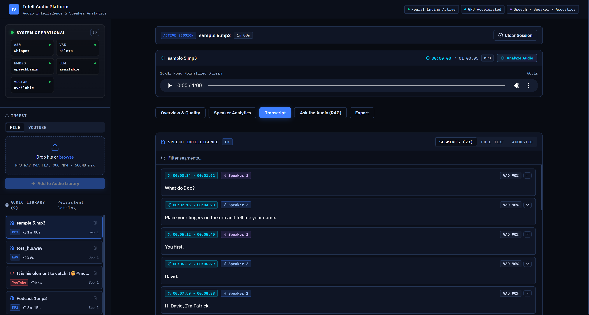
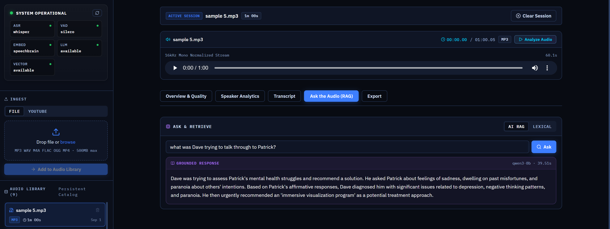
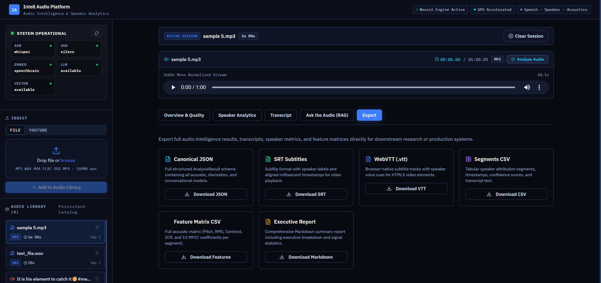

# Intell Audio Inference & Retrieval System (IAIRS)

> **2026 Audio Intelligence Platform**  
> Transform audio into structured, searchable, speaker-aware, acoustically profiled, and timestamp-grounded information.

[](https://www.python.org/)
[](https://fastapi.tiangolo.com/)
[](https://react.dev/)
[](https://qdrant.tech/)
[](https://developer.nvidia.com/cuda-toolkit)
[](LICENSE)

---

## Overview

**Intell Audio Inference & Retrieval System (IAIRS)** is a local-first audio intelligence platform designed to go beyond conventional speech-to-text.

Instead of treating a recording as only a transcript, IAIRS processes audio as a combination of:

- **Speech content** — timestamped transcription
- **Speaker information** — voice embeddings, clustering, and conversation-aware attribution
- **Acoustic information** — pitch, energy, spectral, quality, and noise diagnostics
- **Retrievable knowledge** — hybrid lexical and semantic search
- **Grounded reasoning** — local LLM answers based on retrieved timestamped evidence

The result is a structured, timestamp-aware representation of an audio asset that can be explored through an interactive dashboard, searched directly, queried in natural language, and exported for downstream analysis.

### 2022 → 2026 Evolution

The repository preserves the original 2022 prototype on the `main` branch for historical comparison.

The active 2026 implementation lives on:

```text
v3-multimodal-intelligence
```

The modern system introduces neural speech processing, speaker intelligence, acoustic analytics, hybrid retrieval, grounded RAG, structured persistence, and a React-based developer dashboard.

---

### Dashboard Preview

The 2026 IAIRS frontend provides an interactive workspace for exploring audio from multiple perspectives — signal quality, speaker behavior, synchronized transcription, grounded retrieval, and structured export.

#### Overview & Quality

Inspect the overall health and characteristics of the processed audio, including signal integrity, RMS energy, dynamic range, SNR estimates, speech-to-silence ratio, noise characteristics, and other processing diagnostics.


---

#### Speaker Analytics

Explore speaker distribution and conversational behavior through speaking-time statistics, turn counts, dominant speaker information, and available voice and acoustic characteristics.


---

#### Transcript

Navigate a synchronized, timestamp-aware transcript with speaker attribution. Each segment connects the textual content directly to its position in the audio timeline for fast inspection and playback.



---

#### Ask the Audio — Grounded RAG

Ask natural-language questions about the processed recording. IAIRS combines hybrid retrieval with local LLM reasoning to generate responses based on relevant timestamped transcript evidence.



---

#### Export

Export processed audio intelligence and analysis results in supported formats for further inspection, reporting, subtitle generation, or downstream processing.



---

## Demonstration

A complete demonstration of the 2026 IAIRS pipeline is included in:

```text
assets/IAIRS - 2026.mp4
```

The demo covers media ingestion, pipeline execution, audio quality analytics, speaker intelligence, synchronized transcription, grounded audio retrieval, and export capabilities.

---

# Core Capabilities

## Media Ingestion

- Local file ingestion
- Audio and video container support
- Common formats including MP3, WAV, M4A, FLAC, OGG, and MP4
- YouTube audio ingestion through the configured extraction pipeline
- Persistent media library with session-based active asset handling

## Neural Voice Activity Detection

IAIRS uses **Silero VAD** to identify speech regions before downstream processing.

Post-processing can:

- Filter very short non-useful speech fragments
- Merge closely separated speech intervals
- Preserve useful temporal boundaries
- Produce speech and silence statistics

## Speech Recognition

Speech recognition is powered by **faster-whisper** through the CTranslate2 inference backend.

The resulting timestamped transcript supports:

- Synchronized playback
- Search and retrieval
- Speaker attribution
- Natural-language question answering
- Export

CUDA acceleration is used where available, with compatible CPU fallback paths.

## Speaker Intelligence

Speaker processing is built around **SpeechBrain ECAPA-TDNN** embeddings.

The pipeline:

1. Extracts speaker representations from speech windows
2. Normalizes voice embeddings
3. Measures acoustic similarity
4. Groups acoustically related speech
5. Produces chronological speaker assignments

The system performs **speaker grouping and attribution**, not real-world identity recognition.

## CASA — Conversation-Aware Speaker Attribution

Standard acoustic clustering can struggle with very short responses such as:

> "Yeah."  
> "Okay."  
> "Right."

These segments may contain insufficient audio for a stable voice embedding.

IAIRS adds **CASA — Conversation-Aware Speaker Attribution**, a post-clustering refinement layer that evaluates ambiguous assignments using:

- **Acoustic similarity**
- **Temporal turn continuity**
- **Conversational and linguistic cues**

CASA is intended to stabilize ambiguous conversational turns rather than replace acoustic diarization.

## Acoustic and Signal Analytics

IAIRS can compute audio-level and speech-level analytics including:

- RMS signal energy
- Peak amplitude
- Dynamic range
- Speech / silence ratio
- Estimated signal-to-noise ratio
- Noise floor
- Signal integrity indicators
- Speech segment count
- Average speech segment duration
- Longest silence
- Spectral centroid
- Zero-crossing rate
- Fundamental frequency (`F0`) statistics
- Energy statistics
- Spectral bandwidth and rolloff
- Spectral flux
- MFCC descriptors
- Delta and delta-delta MFCC features
- Speaker talk-time and turn statistics

## Hybrid Retrieval

IAIRS combines two complementary retrieval strategies.

**Lexical retrieval**
- Exact terminology
- Keywords
- Names
- Technical vocabulary

**Dense semantic retrieval**
- Meaning-based matching
- Conceptually related language
- Natural-language queries

The result streams are combined through hybrid ranking using **Reciprocal Rank Fusion (RRF)**.

## Ask the Audio — Grounded RAG

The **Ask the Audio** interface allows users to ask natural-language questions about processed recordings.

```text
User Question
      |
      v
Hybrid Retrieval
(BM25 + Dense Vectors)
      |
      v
Timestamped Audio Context
      |
      v
Local LLM Reasoning
      |
      v
Evidence-Grounded Response
```

The reasoning layer is designed to use retrieved transcript evidence and preserve timestamp grounding where applicable.

When relevant evidence is unavailable, the system is intended to avoid presenting unsupported conclusions as facts.

---

# System Architecture

```text
                         Raw Audio / Video
                   File Upload or YouTube Source
                                |
                                v
                    Audio Normalization Layer
                        16 kHz / Mono Stream
                                |
               +----------------+----------------+
               |                                 |
               v                                 v
        Audio Quality Analysis             Silero VAD
               |                                 |
               |                                 v
               |                         Speech Intervals
               |                                 |
               +----------------+----------------+
                                |
                                v
                         Processing Pipeline
                                |
               +----------------+----------------+
               |                |               |
               v                v               v
        faster-whisper     ECAPA-TDNN      Acoustic Analysis
        Transcription      Embeddings       Pitch / MFCC /
        + Timestamps       + Clustering     Spectral Features
               |                |               |
               +----------------+---------------+
                                |
                                v
                     CASA Speaker Attribution
                                |
                                v
                  Unified Timestamped Audio Segments
                                |
               +----------------+----------------+
               |                                 |
               v                                 v
          SQLite Storage                  Transcript Chunking
                                                 |
                                +----------------+----------------+
                                |                                 |
                                v                                 v
                           BM25 Index                     Dense Embeddings
                                                                  |
                                                                  v
                                                             Qdrant
                                |                                 |
                                +----------------+----------------+
                                                 |
                                                 v
                                          Hybrid Retrieval
                                                 |
                                                 v
                                       Grounded LLM Reasoning
                                                 |
                                                 v
                                   React Dashboard / API / Export
```

---

# Processing Pipeline

## 1. Ingestion and Normalization

Audio is accepted from supported local media files or the configured YouTube ingestion flow.

The processing layer normalizes media into a consistent representation suitable for:

- VAD
- ASR
- Speaker embeddings
- Acoustic feature extraction
- Playback synchronization

## 2. Audio Quality Analysis

IAIRS computes signal-level diagnostics including:

| Metric | Description |
|---|---|
| **RMS Energy** | Overall waveform energy |
| **Peak Amplitude** | Maximum signal magnitude |
| **Dynamic Range** | Variation between quieter and louder regions |
| **Estimated SNR** | Approximate speech-to-noise relationship |
| **Noise Floor** | Estimated background signal level |
| **Speech / Silence Ratio** | Distribution of active speech |
| **Longest Silence** | Largest continuous non-speech interval |
| **Spectral Centroid** | Approximate spectral brightness |
| **Zero-Crossing Rate** | Signal frequency/noise characteristic |
| **Audio Quality Score** | Composite quality indicator |

## 3. Voice Activity Detection

Silero VAD identifies speech-bearing regions.

The resulting intervals become the temporal backbone for later stages such as transcription, speaker analysis, and conversation statistics.

## 4. Speech Recognition

Speech intervals are processed through **faster-whisper** to produce timestamp-aware transcript information.

The transcript is then used for:

- Playback synchronization
- Search
- Speaker analytics
- Natural-language reasoning
- Export

## 5. Speaker Embedding and Clustering

Speech windows are processed with **ECAPA-TDNN** to generate speaker representations.

Similarity-based clustering groups acoustically consistent speech and produces chronological labels such as:

```text
Speaker 1
Speaker 2
Speaker 3
...
```

## 6. CASA Attribution

CASA provides a conversation-aware refinement stage after acoustic speaker clustering.

```text
Ambiguous Segment
       |
       +------------------------------+
       |              |               |
       v              v               v
 Acoustic        Temporal Turn     Conversational
 Similarity       Continuity          Cues
       |              |               |
       +--------------+---------------+
                      |
                      v
             Attribution Decision
```

This stage helps improve consistency where acoustic evidence alone is weak.

## 7. Acoustic Feature Extraction

IAIRS extracts additional information from the audio signal.

### Pitch and Voice

- Fundamental frequency (`F0`)
- Mean pitch
- Pitch variation
- Voiced-frame statistics

### Energy

- RMS energy
- Energy variation
- Peak energy

### Spectral Features

- Spectral centroid
- Spectral bandwidth
- Spectral rolloff
- Spectral flux

### Cepstral Features

- MFCC 1–13
- Delta MFCC
- Delta-delta MFCC

## 8. Structured Temporal Segments

Outputs from transcription, speaker analysis, and acoustic processing are combined into structured timestamp-aware segments.

Conceptually, a segment can contain:

```text
Timestamp
Transcript
Speaker Label
Attribution Information
Acoustic Features
Retrieval Metadata
```

This unified representation connects the pipeline to search, RAG, playback, analytics, and export.

## 9. Hybrid Retrieval and Indexing

Timestamp-preserving transcript chunks are indexed through:

```text
BM25
  +
Dense Vector Retrieval
  +
Qdrant
  |
  v
Hybrid Ranking
```

This supports both exact lexical questions and semantic natural-language queries.

## 10. Grounded Reasoning

Retrieved transcript chunks are supplied to the configured local LLM provider.

```text
Question
   |
   v
Retrieve Relevant Timestamped Evidence
   |
   v
Evaluate Context
   |
   v
Generate Grounded Answer
   |
   v
Return Timestamp-Aware Response
```

---

# Dashboard

The modern frontend provides a developer-oriented interface for exploring processed media.

## Overview & Quality

Displays high-level diagnostics such as:

- RMS energy
- Dynamic range
- Speech / silence ratio
- Dominant speaker
- Signal integrity
- SNR
- Peak amplitude
- Noise floor
- Speech segment count
- Average speech segment duration
- Longest silence
- Spectral centroid
- Zero-crossing rate
- Audio quality score

## Speaker Analytics

Provides speaker-level information including:

- Speaker distribution
- Speaking time
- Turn counts
- Conversational balance
- Dominant speaker
- Available pitch and voice statistics

## Transcript

Provides a timestamp-synchronized transcript for exploring the recording.

Timestamped segments can be used to navigate directly through the media.

## Ask the Audio

Supports two complementary interaction styles:

- **AI RAG mode** for grounded natural-language questions
- **Lexical mode** for direct exact-term search

## Export

Processed results can be exported through the available pipeline in formats such as:

- JSON
- CSV
- SRT
- VTT
- Markdown reports

---

# Technology Stack

| Layer | Technology | Role |
|---|---|---|
| Backend | Python + FastAPI | API and processing services |
| Frontend | React + TypeScript + Vite | Interactive dashboard |
| ASR | faster-whisper / CTranslate2 | Speech recognition |
| VAD | Silero VAD | Speech detection |
| Speaker Embeddings | SpeechBrain ECAPA-TDNN | Voice representation |
| Speaker Clustering | Similarity-based clustering / AHC | Speaker grouping |
| Attribution | CASA | Conversation-aware speaker refinement |
| Acoustic Analysis | Librosa + audio utilities | DSP and speech features |
| Lexical Retrieval | BM25 | Exact-term retrieval |
| Dense Retrieval | Local embedding model | Semantic search |
| Vector Store | Qdrant | Dense vector indexing |
| LLM Provider | LM Studio-compatible local inference | Grounded reasoning |
| Persistence | SQLite | Structured local storage |
| Testing | pytest | Unit and integration testing |

---

# Project Structure

```text
intell-audio-inference-retrieval-system/
|
+-- backend/                  # API routes and backend interfaces
+-- config/                   # Configuration and environment settings
+-- core/                     # Pipeline orchestration and event infrastructure
+-- database/                 # SQLite persistence and repositories
+-- engines/                  # ASR and VAD engine abstractions
+-- frontend/
|   +-- react/                # React + TypeScript dashboard
|   +-- streamlit_app.py      # Preserved developer / legacy interface
+-- retrieval/                # BM25, vector, and hybrid retrieval
+-- schemas/                  # Domain models and validation schemas
+-- services/                 # Audio intelligence services
|   +-- acoustic_service.py
|   +-- audio_quality_service.py
|   +-- audio_service.py
|   +-- casa_config.py
|   +-- casa_engine.py
|   +-- chunker.py
|   +-- conversation_analyzer.py
|   +-- export_service.py
|   +-- health_service.py
|   +-- llm_service.py
|   +-- reasoning_agent.py
|   +-- speaker_embedding_service.py
|   +-- transcription_service.py
|   +-- vad_service.py
+-- tests/                    # Unit and integration tests
+-- workers/                  # Processing and indexing workers
+-- assets/                   # Repository media assets and demos
+-- app.py                    # Application entry point
+-- docker-compose.yml        # Local infrastructure definition
+-- requirements.txt          # Python dependencies
+-- .env.example              # Environment configuration template
+-- README.md
```

---

# Installation

## Prerequisites

The exact environment depends on the enabled pipeline components.

Typical requirements include:

- Python 3.11+
- Node.js and npm
- FFmpeg available to the media pipeline
- Docker Desktop for local Qdrant
- LM Studio or another compatible configured local inference provider
- NVIDIA GPU with CUDA for accelerated inference where supported

CPU execution is possible for compatible components, although GPU acceleration is recommended for faster processing.

## 1. Clone the Repository

```bash
git clone https://github.com/vishnudaspk/intell-audio-inference-retrieval-system.git
cd intell-audio-inference-retrieval-system
```

Switch to the active 2026 implementation:

```bash
git switch v3-multimodal-intelligence
```

## 2. Create the Python Environment

### Windows PowerShell

```powershell
python -m venv .venv
.\.venv\Scripts\Activate.ps1
pip install -r requirements.txt
```

### Linux / macOS

```bash
python3 -m venv .venv
source .venv/bin/activate
pip install -r requirements.txt
```

## 3. Configure Environment Variables

Create a local environment file from the repository template.

### Windows PowerShell

```powershell
Copy-Item .env.example .env
```

### Linux / macOS

```bash
cp .env.example .env
```

Review `.env.example` and configure the providers and models available on your system.

Typical configuration areas include:

```ini
ASR_ENGINE=whisper
VAD_ENGINE=silero

SPEAKER_EMBEDDING_ENGINE=speechbrain

LM_STUDIO_BASE_URL=http://localhost:1234
LM_STUDIO_CHAT_MODEL=<your-local-chat-model>
LM_STUDIO_EMBEDDING_MODEL=<your-local-embedding-model>

QDRANT_URL=http://localhost:6333
QDRANT_COLLECTION=intell_audio_chunks
```

Use the actual model identifiers configured in your environment.

## 4. Start Qdrant

If the repository Docker configuration is available:

```bash
docker compose up -d
```

Verify the container:

```bash
docker ps
```

## 5. Start the Local LLM / Embedding Provider

Start the configured local inference server.

For an LM Studio-based setup, ensure that:

- The chat model is loaded
- The embedding model is available to the configured pipeline
- The local server is running
- The model names match your `.env` configuration

## 6. Start the Backend

From the repository root:

```bash
python app.py
```

## 7. Start the Frontend

```bash
cd frontend/react
npm install
npm run dev
```

Open the development address shown by Vite in the terminal.

---

# Usage

## 1. Ingest Media

Add a supported local media file or use the configured YouTube ingestion workflow.

The asset is added to the audio library.

## 2. Run the Pipeline

The processing flow performs the configured stages:

```text
Normalization
    ->
Audio Quality Analysis
    ->
Voice Activity Detection
    ->
Speech Recognition
    ->
Speaker Embeddings and Clustering
    ->
CASA Attribution
    ->
Acoustic Feature Extraction
    ->
Structured Segment Assembly
    ->
Hybrid Indexing
```

## 3. Inspect Audio Quality

Open **Overview & Quality** to inspect signal characteristics and processing diagnostics.

## 4. Analyze Speakers

Open **Speaker Analytics** to inspect speaker distribution, speaking time, turns, and available voice statistics.

## 5. Explore the Transcript

Use the synchronized transcript to navigate the recording through timestamped speech segments.

## 6. Ask the Audio

Use the RAG interface to ask questions about the processed recording.

Examples:

```text
What were the main points discussed?

When was the deployment problem mentioned?

What did Speaker 2 say about the proposal?

Was a specific technology mentioned in the recording?
```

## 7. Export Results

Export the processed analysis through the available formats.

---

# Testing

Run the test suite from the repository root.

### Windows

```powershell
.\.venv\Scripts\python.exe -m pytest tests/ -v
```

### Linux / macOS

```bash
python -m pytest tests/ -v
```

The test suite covers multiple parts of the platform, including:

- Acoustic feature extraction
- Audio quality analytics
- VAD processing
- Speaker embeddings
- CASA attribution
- BM25 retrieval
- Hybrid retrieval
- Grounded reasoning
- API lifecycle behavior
- Pipeline integration

---

# 2022 Legacy vs 2026 IAIRS

| Capability | 2022 Prototype | 2026 IAIRS |
|---|---|---|
| Architecture | Streamlit-oriented monolithic workflow | Decoupled service architecture with API and React dashboard |
| Speech Recognition | Earlier speech processing stack | faster-whisper |
| Speech Detection | Traditional pipeline flow | Neural Silero VAD |
| Alignment | External / legacy alignment workflow | Native timestamp-aware transcription pipeline |
| Speaker Intelligence | Not available | ECAPA embeddings + clustering + CASA |
| Acoustic Analytics | Limited / not integrated | Signal, spectral, pitch, MFCC, and quality analytics |
| Search | Basic transcript-oriented search | Hybrid lexical + semantic retrieval |
| Question Answering | Not available | Evidence-oriented local RAG |
| Persistence | Simpler legacy storage | Structured SQLite persistence |
| Frontend | Streamlit prototype | React + TypeScript developer dashboard |

The 2022 implementation remains preserved for historical comparison.

---

# Current Limitations

IAIRS is an actively evolving experimental system.

## Overlapping Speech

The current pipeline is optimized primarily for turn-taking speech.

Simultaneous cross-talk is more difficult because multiple voices can occupy the same temporal region.

## Speaker Variability

Speaker embeddings can be affected by:

- Strong reverberation
- Significant microphone changes
- Extreme background noise
- Very short speech turns
- Large changes in recording conditions

CASA helps with some ambiguous conversational cases but is not a replacement for dedicated overlapping-speech separation.

## Local Deployment Focus

The current architecture is designed primarily for local development and workstation inference.

Large-scale distributed deployment would require additional infrastructure for:

- Distributed workers
- Job queues
- Event brokers
- Horizontal scaling
- Observability

## Video Intelligence

Video containers can be ingested for their audio tracks.

Visual understanding, scene analysis, OCR, and frame-level multimodal reasoning are future directions rather than core capabilities of the current audio pipeline.

---

# Roadmap

- [x] Modernize the audio processing architecture
- [x] Integrate neural VAD and faster-whisper transcription
- [x] Add speaker embeddings and clustering
- [x] Implement CASA conversation-aware speaker attribution
- [x] Add acoustic and signal quality analytics
- [x] Implement hybrid BM25 + vector retrieval
- [x] Add timestamp-aware grounded audio RAG
- [x] Build a modern developer analytics dashboard
- [ ] Improve interruption and turn-transition intelligence
- [ ] Improve overlapping-speech handling
- [ ] Add deeper conversation analytics
- [ ] Add synchronized visual/video intelligence
- [ ] Add production-oriented distributed processing and deployment

---

# Project Status

The repository contains two historical stages of the project:

- **`main`** — preserved 2022 legacy implementation
- **`v3-multimodal-intelligence`** — active 2026 IAIRS architecture

For the latest modern implementation:

```bash
git switch v3-multimodal-intelligence
```

---

# License

This project is licensed under the **MIT License**. See [LICENSE](LICENSE) for details.

---

## Author

**Vishnu Das**

GitHub: https://github.com/vishnudaspk

---

## Why IAIRS?

> **Audio is more than text.**

A recording contains language, timing, speaker behavior, acoustic characteristics, conversational structure, and context.

IAIRS is designed to bring those layers together into one searchable and inspectable local intelligence pipeline.
